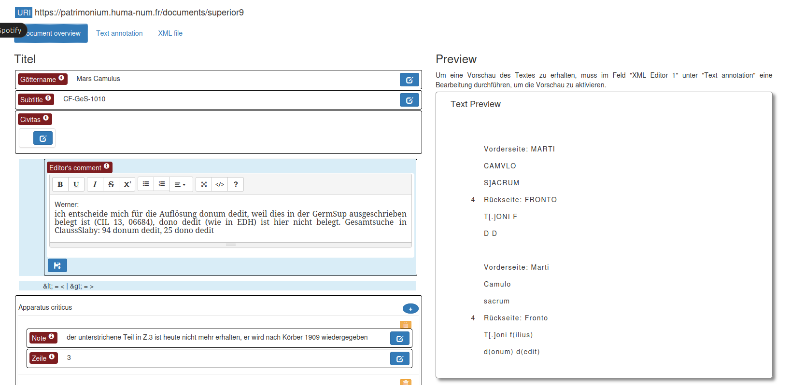

# Patrimonium Editor for Fercan
Project-specific adaptation of https://patrimonium.huma-num.fr/atlas/editor/

## Introduction

This document serves as a guide for users and developers involved in customising the Patrimonium Editor specifically for the Fercan project. The Fercan project, which focuses on the study of Celtic divine names in ancient inscriptions, uses the Patrimonium Editor to manage and analyse epigraphic data. This document outlines the scope of the customisation, introduces the project, and details the integration and extensions made to the Patrimonium Editor to meet the specific needs of the project.

The Fercan project is supported by the Austrian Science Fund (FWF) through grants P 29274-G25 and P 34422 G. It aims to explore Celtic divine names in the Roman provinces of Germania Inferior and Germania Superior, with a focus on understanding cultural interactions and religious dynamics during the Roman period. The research examines how local Celtic traditions were integrated into Roman practices, using epigraphic evidence to trace changes and continuities in religious expression.

## Patrimonium Editor

The Patrimonium Editor is an integrated suite of web applications tailored for academic and research use, focusing on the encoding, management and analysis of epigraphic and historical textual sources. Prior to customisation, it included an XML editor for accurate text encoding, text conversion tools that adhere to the Leiden Conventions, and data management capabilities for handling information about places, people, and thematic categories relevant to historical texts. It is designed to support a wide range of epigraphic documentation needs and is suitable for a variety of academic and research environments.

Its modular architecture not only provides considerable flexibility in terms of customisation, but also leverages the robust power of the eXist-db XML database. Structured to work with the TEI (Text Encoding Initiative) and EpiDoc (Epigraphic Documents) guidelines, the editor provides a robust framework for document encoding and data representation. This basic design allows it to be adapted to the specific needs of different research projects, ensuring that the Patrimonium Editor remains a versatile tool for scholars in the digital humanities.

### Core Components

**1. Base Library: ausohnum-library**.

Serves as the base library that provides backend functionality. It contains a collection of XQuery functions, JavaScript scripts and CSS stylesheets long with other resources needed to build the TEI/EpiDoc editor, places manager, and people manager. This library contains reusable modules that handle various tasks such as data retrieval, transformation, presentation and interaction within the web application framework.It includes modules, resources, templates and a build configuration (`build.xml`) as well as a collection configuration (`collection.xconf`).

**2. Front-end application: eStudium**.

The primary user interface where the actual interaction with the coded texts and datasets takes place. It is the main web application of eXist-db. Provides project-specific settings such as customisation of TEI elements and templates, making it adaptable to the specific needs of different historical projects. Includes an easy-to-use XML editor that provides users with tools for encoding, editing, and wrapping text with XML elements in a visually accessible interface.

**3. Data repository: eStudiumData**.

Serves as a data repository application supporting the eStudium front-end. This includes TEI-coded texts, records of places and people, and thesaurus schemas. Ensures data integrity and retrievability. It is optimised for efficient querying and manipulation of the XML data that is central to the function of the Patrimonium Editor.

### Functional Overview & Technical Infrastructure & Data Models

**Text Editor**
- XML encoding: The text editor panel allows easy creation and editing of XML files, facilitating epigraphic text encoding by wrapping selected text with the necessary XML tags.
- Tools: Includes a number of additional editing tools such as search and replace, validation and formatting options to assist users in creating valid and well-structured TEI documents..

**Places Manager:**
- **Spatial Data**: Supports the creation and curation of spatial entities. It is designed to interact with place data models such as Pleiades and other ontologies that help connect, organise and relate spatial information.
- **Integration**: Links places to texts and other datasets within the Patrimonium framework, enabling multi-dimensional analysis of epigraphic data.

**People Manager:**
- **Prosopographical Data**: Manages the creation and curation of person-related data, using models such as SNAP:DRGN to describe historical figures, their attributes, and their relationships to one another.
- **Linkage**: Ensures that individuals mentioned in texts are accurately documented and linked, providing a comprehensive prosopographical dataset.

**Thesaurus Management:**
- **Controlled Vocabulary**: Handles thesaurus systems which provide controlled vocabularies for subjects, objects, and terms used within historical texts.
- **Standardization**: Aims to standardize the terminology used across documents, facilitating consistent tagging and easier retrieval of related texts.

**Zotero Integration:**
- **Bibliographic Data**: The editor integrates with Zotero, allowing users to manage references and bibliographic data directly within the application.
- **Synchronization**: Ensures that citations and sources are kept up-to-date and are easily accessible during the research and documentation process.

- **eXist-db**: A NoSQL XML database at the core of the Patrimonium Editor, responsible for storing, indexing, and querying XML data.
- **XML Standards**: Compliance with TEI and EpiDoc standards for encoding texts, ensuring that data conforms to internationally recognized guidelines in digital humanities.
- **Web Application**: The editor is accessible through a web browser, reducing the need for local installation and allowing for collaborative work across different locations.

**Data Models:**
- **Places Documents**: Based on Pleiades and NeoGeo spatial ontologies, enriched with connections described in SKOS and Dublin Core.
- **People Documents**: Modeled after Pleiades Place and SNAP:DRGN standards, also utilizing SKOS and Dublin Core for describing and relating individuals in historical texts.

### Setting Up the Patrimonium Editor

The source files for the Patrimonium Editor are packaged in `.xar` format, which is a standard package format used by the eXist-db XML database system. These files include all the necessary components and configurations needed for the editor to function properly.

- **.xar Files**: A `.xar` file is an XML Archive used by eXist-db to package applications. It contains all the resources required for an application, such as scripts, stylesheets, and XML documents, structured in a way that eXist-db can easily deploy.
- **Ant**: Apache Ant is a Java-based build tool used to automate software build processes. It is used to compile source code, copy files, and execute other tasks defined in an XML file called `build.xml`. In the context of Patrimonium Editor, Ant is used to build `.xar` files from source code and resources. More information on Ant can be found at the [official Apache Ant website](https://ant.apache.org/).

#### Installing Packages in eXist-db
To deploy the Patrimonium Editor on an eXist-db instance, you need to install the `.xar` packages through the eXist-db's Package Manager. This can be accessed via the dashboard at `http://localhost:8080/exist/apps/dashboard/index.html` after setting up the eXist-db instance. The following `.xar` packages are required:
- **ausohnum-library**: The main program that includes core functionalities.
- **estudium**: Contains project-specific customizations.
- **estudiumData**: Includes the data files, primarily XML/TEI documents.

These packages are uploaded and installed through the Package Manager in the eXist-db dashboard.

#### Setting Up eXist-db with Docker
Using Docker simplifies the process of setting up eXist-db. Docker can encapsulate the environment needed to run eXist-db without altering your system's configuration. Here’s how you can start the eXist-db Docker container, typically using Docker Desktop:

1. **Download and Install Docker Desktop**: Ensure Docker is installed on your machine. Docker Desktop is available for Windows, Mac, and Linux.
2. **Run eXist-db Container**: You can start an eXist-db container using the Docker command line. Here’s an example command to run the container:
   ```bash
   docker run -d -p 8080:8080 existdb/existdb:latest
   ```
   This command downloads the latest eXist-db image and runs it, exposing port 8080 for web access.

3. **Accessing eXist-db**: Once the Docker container is running, you can access the eXist-db dashboard by navigating to `http://localhost:8080/exist/apps/dashboard/index.html` in your web browser.

#### Tips for Managing Browser Sessions
- **Inkognito Mode**: To avoid issues with browser caching when logging in to the eXist-db dashboard, consider using an incognito window. This prevents the browser from storing session data.
- **Alternate Browsers**: If you encounter issues with one browser, try accessing the dashboard with a different one to rule out browser-specific caching issues.
- **Disable Cache**: Alternatively, you can disable the cache in your browser settings when working on application setup to ensure that changes are reflected immediately.

## Customisation of the Patrimonium editor

The customised Fercan editor uses less funcationality from the original editor. it removes the place and person ediro. and focuses only on having two corous and on adding the metadata and the transcription.

### Customization of the Patrimonium Editor

#### Using the Patrimonium Editor

The Patrimonium Editor is designed to be a versatile tool for historians and researchers working on the Fercan project. Here’s how individuals typically interact with the system:

1. **Accessing the Editor**:
   - The editor is accessed via the eXist Dashboard, specifically through the eStudium application. The applications `ausohnum-lib` and `eStudiumData` must be present, but users do not need to interact with them directly.
   - Local access can be achieved at `http://localhost:8080/exist/apps/estudium/`.
   - Users log in on the right side of the interface as either 'admin' or 'editor'.

2. **Creating and Managing Documents**:
   - To create a new document, users select the "New Document" option and choose a template, such as "Germania_Inferior".
   - Once created, the document, e.g., `inferior467`, can be accessed for editing at `http://localhost:8080/exist/apps/estudium/edit-documents/inferior467` and viewed within the Corpora directory at `http://localhost:8080/exist/apps/estudium/admin/corpus/germania_inferior`.

3. **Entering Data into the Document**:
   - **Metadata Entry**: Users input metadata under "Document Overview". It includes handling unique cases and adjusting the sequence of information as required.
   - **Text Entry and Formatting**: Ensuring proper text formatting while entering data is critical. Tools are provided to remove unwanted formatting from sources like MS Word (e.g., using "Paste as Text").

### Corpus View and Document Management in the Patrimonium Editor

#### Overview of Corpus View
The Corpus View in the Patrimonium Editor is a central interface where users can manage and view various documents related to their research. Accessible via `http://localhost:8080/exist/apps/estudium/admin/`, it integrates directly with modules from the `ausohnum-library`, specifically utilizing the `teiEditorApp.xql` for managing TEI (Text Encoding Initiative) formatted documents.

#### Document Storage and Naming
When documents are created in the eStudium interface, they are stored in the directory path corresponding to their corpus, such as `eStudiumData/documents/$corpus`. Here, each document is named sequentially (e.g., `Doc1.xml`, `Doc2.xml`, etc.), facilitating organized storage and easy retrieval.

#### Ingesting Existing Files
To ingest existing files into the system:
1. **XML ID Assignment**: Existing TEI documents need to be assigned a unique `xml:id`. This identifier is added to the `<TEI>` element as shown below:
   ```xml
   <TEI xmlns="http://www.tei-c.org/ns/1.0" xmlns:xsi="http://www.w3.org/2001/XMLSchema-instance" xml:id="doc1000">
   ```
   This process ensures that each document is uniquely identifiable within the system.

#### Customizing TEI Elements
The `teiElements.xml` file allows for the customization of data displayed in the editor. For instance, you can define how various TEI elements are handled within the user interface:

- **Example of a TEI Element Definition for Language**:
  ```xml
  <teiElement>
      <nm>textMainLang</nm>
      <xpath>/tei:text/@mainLang</xpath>
      <contentType>attribute</contentType>
      <cardinality>1</cardinality>
      <formLabel xml:lang="en">Main language</formLabel>
      <formLabel xml:lang="fr">Langue principale</formLabel>
      <fieldType>combobox</fieldType>
      <thesauDb>internal</thesauDb>
      <thesauTopConceptURI>http://ausonius.huma-num.fr//concept/c39</thesauTopConceptURI>
      <attributeValueType>xml-value</attributeValueType>
      <comments/>
  </teiElement>
  ```

- **Example of a TEI Element Definition for Document Title**:
  ```xml
  <teiElement>
      <nm>docTitle</nm>
      <xpath>/tei:teiHeader/tei:fileDesc/tei:titleStmt/tei:title</xpath>
      <contentType>text</contentType>
      <cardinality>1</cardinality>
      <formLabel xml:lang="en">Göttername</formLabel>
      <fieldType>input</fieldType>
      <comments/>
  </teiElement>
  ```

#### Document Editor Configuration (`Document-editor.xql`)
This XQuery script defines the input fields within the document editor. For instance, to generate the input field for the document title, the script includes a function call like:
```xquery
{teiEditor:displayElement('docTitle', (), (), ())}
```
This function dynamically creates the UI components based on the definitions in `teiElements.xml`, allowing for a highly customizable editing environment.

### Document Overview



The "Document Overview" serves as a portal for scholars to record metadata relevant to their epigraphic research. It's designed to shape the foundational data linked to each entry in the Fercan project's digital repository.

Customized data fields in the "Document Overview" include:

**Title (Titel)**
- **Deity Name (Göttername)**: This field is intended for inputting the names of deities, like "Mars Camulus," mentioned within inscriptions.
- **Subtitle**: Provides space for additional details or identifiers, such as "CF-GeS-1010."
- **Civitas**: Here, users can choose the relevant civitas from a dropdown menu.

The **Editor's Comment** area is reserved for editorial input and is not part of the main data corpus. These comments serve as internal annotations for editorial reference.

The **Apparatus Criticus** section facilitates the compilation of notes or observations regarding the inscriptions, enhancing the document's scholarly utility.

## Resources

- **General Overview**:
  - A general presentation of the Patrimonium Editor was given at the epigraphy.info IV workshop in Hamburg on February 20, 2020. [Download the presentation (2.03 MB)](https://patrimonium.huma-num.fr/atlas/editor/presentations/epigraphy_info_IV_2020.pdf)
- **Handling of Spatial Information**:
  - A presentation focused on the handling of spatial information by the Patrimonium Editor was showcased at the Assises MAGIS 2020 (online) on June 24, 2020. [Download the presentation (2.6 MB)](https://patrimonium.huma-num.fr/atlas/editor/presentations/assises_MAGIS_2020.pdf)
- **Recent Developments**:
  - A poster highlighting recent developments and features of the Patrimonium Editor was presented at the epigraphy.info V workshop in Leuven (online) on November 5, 2020. [Download the poster (1.245 MB)](https://patrimonium.huma-num.fr/atlas/editor/presentations/epigraphy_info_V_2020.pdf)
